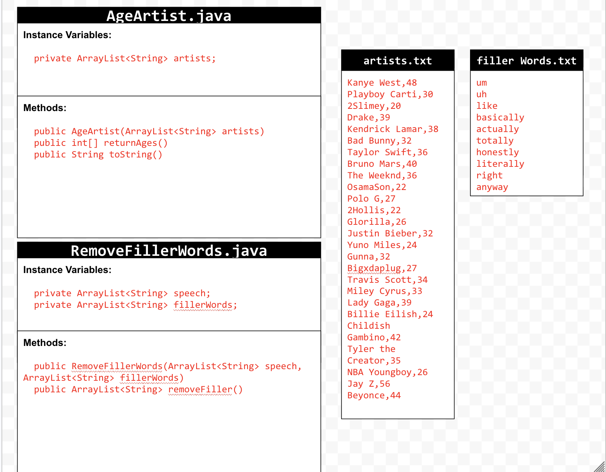
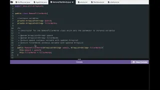

# Unit 6 - Natural Language Processing Project

## Introduction

Natural language processing (NLP) is used in many apps and devices to interact with users and make meaning of text to determine how to respond, find information, or to create new text. Your goal is to use natural language processing techniques to identify structure, patterns, and meaning in a text to have conversations with a user, execute commands, perform manipulations on the text, or generate new text.

## Requirements

Use your knowledge of object-oriented programming, ArrayLists, the String class, and algorithms to create a program that uses natural language processing techniques:

- **Create at least two ArrayLists** – Create at least two ArrayLists to store the data used in your program, such as data from text files or entered by the user.
- **Implement one or more algorithms** – Implement one or more algorithms that use loops and conditionals to find or manipulate elements in an ArrayList or String object.
- **Use methods in the String class** - Use one or more methods in the String class in your program, such as to divide text into sentences or phrases.
- **Use at least one natural language processing technique** – Use a natural language processing technique to process, analyze, and/or generate text.
- **Document your code** – Use comments to explain the purpose of the methods and code segments and note any preconditions and postconditions.

## UML Diagram

Put an image of your UML Diagram here. Upload the image of your UML Diagram to your repository, then use the Markdown syntax to insert your image here. Make sure your image file name is one word, otherwise it might not properly get displayed on this README.

## Video

## Project Description

There are two pieces of texting being analyzed in my project: one is a list showing artists and their ages, and the other is a list of filler words used to edit an existing speech. The AgeArtist class takes all of the artists in the text file and outputs their ages in an int 1D array. The RemoveFillerWords class takes an existing speech in an ArrayList and removes all of the meaningless filler words in order to make the text flow better. We used substring methods, parseInt, and indexOf to implement natural language processing into our project.

## NLP Techniques

The natural language technique we implemented into out project was using the substring keyword to output pieces of a String in a list. The methods that are associated with this are substring, which is used for cutting strings; parseInt, which is used to turn pieces of a string into integers; and indexOf in order to find where pieces of a string are located. These methods are necessary in the NLP techniques of sorting and pulling out pieces of information.